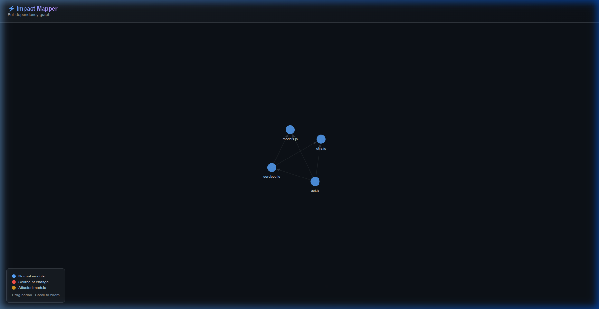

# ⚡ Impact Mapper

**Know what breaks before you break it.**

A CLI tool that uses static analysis to map your JavaScript codebase's internal dependencies. It parses your code into an AST using Babel, traces every reference to any function, class, or variable, and generates a dependency graph showing exactly which modules will break if you change it.

---

## 🎯 The Problem

You want to rename a function, change a class interface, or modify a utility — but you have no idea how many files depend on it. Searching with `Ctrl+F` misses dynamic references. Guessing leads to scope creep and broken builds.

**Impact Mapper solves this** by performing static analysis on your entire codebase and giving you a precise, color-coded impact report before you change a single line.

---

## ✨ Features

| Feature | Description |
|---|---|
| 🔍 **Entity Discovery** | Finds every function, class, and variable — including arrow functions, default exports, and CommonJS `module.exports` |
| 💥 **Impact Analysis** | Traces every reference across all files: calls, instantiations, imports, member accesses |
| 🕸️ **Dependency Graph** | Interactive D3.js force-directed graph with zoom, pan, and drag |
| 🎯 **Severity Rating** | NONE / LOW / MEDIUM / HIGH based on how many modules are affected |
| 📦 **Import Tracing** | Understands both ES modules (`import/export`) and CommonJS (`require/module.exports`) |
| ⚡ **Zero Config** | Point at any JS project directory — no setup, no config files, no build step |

---

## 🚀 Quick Start

```bash
# Install globally
npm install -g impact-mapper

# Or use npx without installing
npx impact-mapper scan ./my-project
```

```bash
# Scan your project
impact-mapper scan /path/to/your/js/project

# Check impact of changing a function
impact-mapper impact /path/to/your/js/project -e "myFunction" -f "myFile.js"

# Generate an interactive dependency graph
impact-mapper graph /path/to/your/js/project -o graph.html
```

---

## 📋 Commands

### `scan` — Discover all entities

```bash
impact-mapper scan ./my-project
```

Lists every function, class, and variable in the project, showing whether each is exported or local.

```
  📄 services.js
    ├─ ƒ func   createUser       ⬆ exported  :8
    ├─ ƒ func   processCheckout  ⬆ exported  :38
    ├─ ▪ var    order            ⬚ local     :23
```

### `impact` — Analyze change impact

```bash
# Basic usage
impact-mapper impact ./my-project -e "calculateTotal" -f "utils.js"

# With HTML graph output
impact-mapper impact ./my-project -e "User" -f "models.js" -o impact.html
```

| Option | Required | Description |
|---|---|---|
| `-e, --entity <name>` | ✅ | Name of the function, class, or variable |
| `-f, --file <name>` | ❌ | File where the entity is defined (for disambiguation) |
| `-o, --output <path>` | ❌ | Generate an HTML graph with impact highlighting |

Output:
```
  💥 IMPACT MAPPER — Impact Report

  Target:   calculateTotal (ƒ Function)
  Defined:  utils.js:7
  Exported: Yes
  Severity: ■ LOW (2 modules affected)

  📄 services.js ← AFFECTED
    ├─ ⬇ import         :6  const { calculateTotal } = require('./utils');
    ├─ ▶ call           :28 const total = calculateTotal(order.products);

  📄 api.js ← AFFECTED
    ├─ ⬇ import         :7  const { calculateTotal } = require('./utils');
    ├─ ▶ call           :24 const total = calculateTotal(items);

  ⚠  Modules that will break:
    ✗ services.js
    ✗ api.js
```

### `graph` — Export dependency graph

```bash
impact-mapper graph ./my-project -o deps.html
```

Generates a self-contained HTML file with an interactive D3.js force-directed graph. Open in any browser — drag nodes, scroll to zoom, hover edges for import details.

<p align="center">
  
</p>

---

## ⚙️ How It Works

```
JS Source Code
     │
     ▼
@babel/parser  ──→  AST (Abstract Syntax Tree)
     │
     ▼
@babel/traverse ──→  Walk every node
     │
     ├──→ discoverEntities()  → What exists
     ├──→ extractImports()    → Who imports what
     └──→ findReferences()    → Every usage of an entity
              │
              ▼
       Impact Report + Dependency Graph
```

1. **Parse** — `@babel/parser` reads each `.js` file and produces an AST
2. **Discover** — `@babel/traverse` walks the AST to find all declared entities and exports
3. **Trace** — For a given entity, traverse all project files that import from its defining module, classify each reference by its AST parent node (call, instantiation, import, member-access)
4. **Report** — Render as a rich terminal tree or an interactive HTML graph

---

## 🏗️ Architecture

```
impact-mapper/
├── main.js               # Entry point
├── src/
│   ├── cli.js            # CLI commands (commander.js)
│   ├── analyzer.js       # Core engine: AST parsing, entity discovery,
│   │                     #   reference tracing, dependency graph
│   ├── resolver.js       # JS module path resolution
│   └── visualizer.js     # Terminal (chalk) + HTML (D3.js) output
├── sample_project/       # Demo project for testing
│   ├── models.js         # User, Product, Order classes
│   ├── utils.js          # Helper functions
│   ├── services.js       # Business logic
│   └── api.js            # API handlers
└── docs/
    └── index.html        # Documentation website
```

---

## 📚 Programmatic API

Use the analyzer directly in your own Node.js scripts:

```javascript
const { ImpactAnalyzer } = require('impact-mapper');

const analyzer = new ImpactAnalyzer('./my-project');
analyzer.scan();

// Get impact report
const impact = analyzer.getImpact('calculateTotal', 'utils.js');
console.log(impact.affectedModules); // ['services.js', 'api.js']
console.log(impact.severity);        // 'LOW'

// Build dependency graph
const graph = analyzer.getDependencyGraph();
console.log(graph.nodes); // [{ id: 'models.js', ... }, ...]
console.log(graph.edges); // [{ from: 'services.js', to: 'models.js', imports: [...] }, ...]
```

| Method | Returns | Description |
|---|---|---|
| `scan()` | `{ fileCount, entityMap }` | Discover all files and entities |
| `findEntity(name, file?)` | `Entity \| null` | Locate an entity by name |
| `getImpact(name, file?)` | `ImpactReport` | Full impact analysis with severity |
| `getDependencyGraph()` | `{ nodes[], edges[] }` | Module-level dependency graph |

---

## 🛠️ Tech Stack

- **[@babel/parser](https://babeljs.io/docs/babel-parser)** — JavaScript to AST
- **[@babel/traverse](https://babeljs.io/docs/babel-traverse)** — AST traversal
- **[chalk](https://www.npmjs.com/package/chalk)** — Terminal colors
- **[commander](https://www.npmjs.com/package/commander)** — CLI framework
- **[D3.js](https://d3js.org)** — Interactive graph visualization

---

## 📄 License

Apache license 2.0
